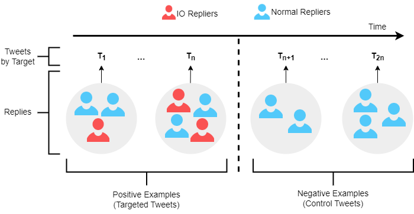

# **Replication code for "Coordinated Reply Attacks in Influence Operations: Characterization and Detection"**

This repository contains code to replicate the results in the paper: "Coordinated Reply Attacks in Influence Operations: Characterization and Detection"

## Introduction
Coordinated reply attacks are a tactic observed in online influence operations and other coordinated campaigns to support or harass targeted individuals, or influence them or their followers.
Despite its potential to influence the public, past studies have yet to analyze or provide a methodology to detect this tactic.
In this study, we characterize coordinated reply attacks in the context of influence operations on Twitter. 
Our analysis reveals that the primary targets of these attacks are influential people such as journalists, news media, state officials, and politicians. 

We propose two supervised machine-learning models, one to classify tweets to determine whether they are targeted by a reply attack, and one to classify accounts that reply to a targeted tweet to determine whether they are part of a coordinated attack. 
The classifiers achieve AUC scores of 0.88 and 0.97, respectively. 
These results indicate that accounts involved in reply attacks can be detected, and the targeted accounts themselves can serve as sensors for influence operation detection. 


## Replicating the results:

### DOI for data: 

### Requirement:
```python
python>=3
pandas==2.2.2
imbalanced-learn==0.12.3
scikit_learn==1.5.0
shifterator==0.3.0
stopwordsiso==0.6.1
wordcloud==1.9.3
```

### Installing helper package:
From the root directory of the project, type the following in the command line.
```python
cd io-coordinated-replies
pip install package/setup.py
```

### Data:
Copy the data folder to project folder from the URL:
[](Link)

### Folder structure:
- ```data``` all the datasets required to replicate the results
- ```package``` helper packages
- ```plots``` plots of results
- ```results``` results of the analysis
- ```RQ1``` scripts to run analysis for RQ1
- ```RQ2``` scripts to run analysis for RQ2
- ```RQ3``` scripts to run analysis for RQ3

### Acknowledgements:
This work  was  supported  in  part  by  Knight Foundation,  Craig Newmark Philanthropies, DARPA (contract HR001121C0169), and Lilly Endowment, Inc., through its support for the Indiana University Pervasive Technology Institute.

### Questions:
Any question should be directed to [Manita Pote](https://manitapote.github.io/)
